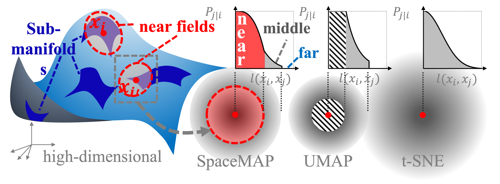

# SpaceMAP

SpaceMAP is a dimensionality reduction method utilizing the local and global intrinsic dimensions of the data to better alleviate the 'crowding problem' analytically. 

## Paper

[https://icml.cc/virtual/2022/spotlight/18170](https://icml.cc/virtual/2022/spotlight/18170)

[https://proceedings.mlr.press/v162/zu22a.html](https://proceedings.mlr.press/v162/zu22a.html)

## Hyper-parameters

SpaceMAP has 4 main hyper-parameters: n-near/n-middle and d-local/d-global, which define the intrinsic dimensions and the hierarchical manifold approximation.

- n-near: number of neighbors in the near fields of each data point. (default: 20)
- n-middle: number of neighbors in the middle field of each data point. (default: 1% of the whole dataset)
- d-local: estimated intrinsic dimensions of the near fields of each data point. (default: Auto)
- d-global: estimated intrinsic dimension of the whole dataset. (default: Auto)

# Installation

